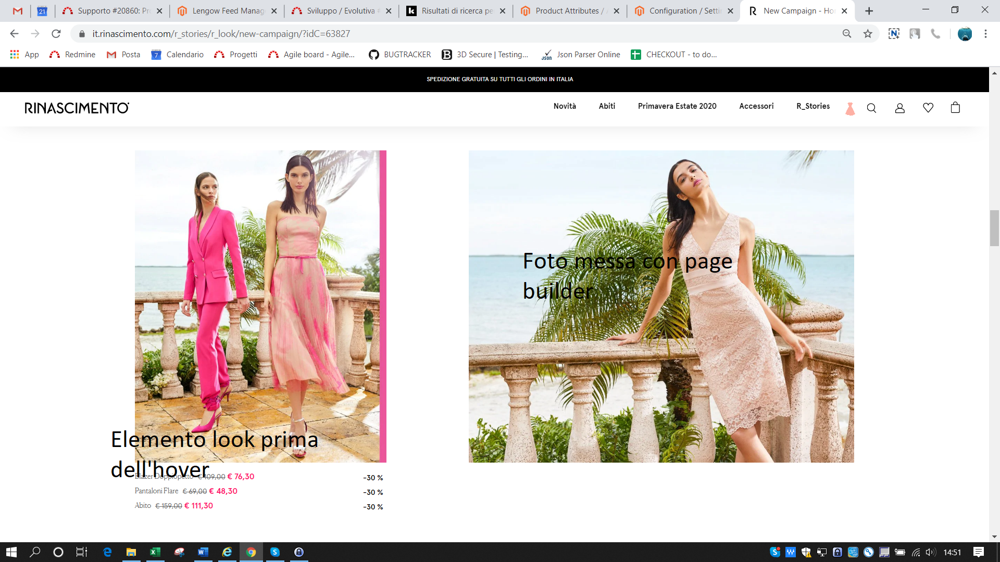
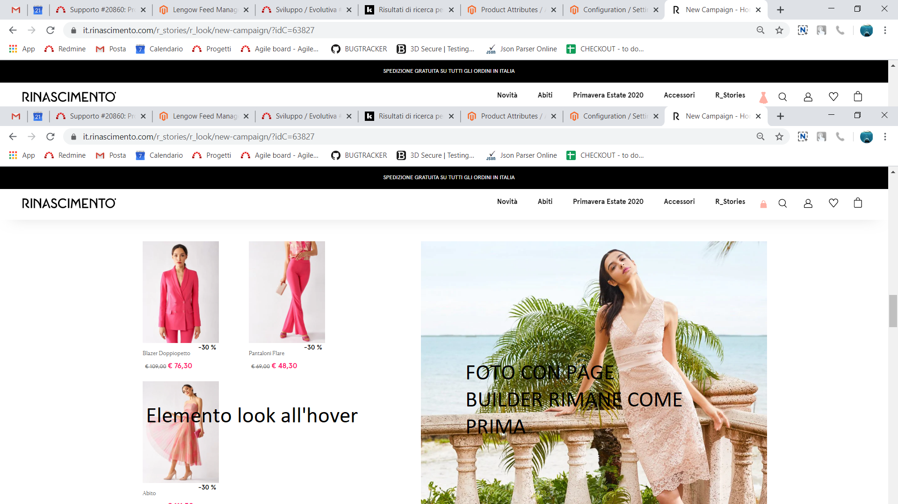

# Modulo "Webformat_Training - LookBook"

|Specifica|Note|
|---------|----|
|Le pagine di tipo Lookbook sono composte dai seguenti tre elementi:
- Banner
- Contenuti testuali
- Look con prodotti suggeriti al mouse hover

Questi tre elementi potranno essere composti a piacere per creare la struttura di pagina desiderata tramite Page Builder.

Creare un nuovo widget disponibile in modo da gestirne poi l'iserimento poi con pagebuilder.
Nome: “Look element”

Il funzionamento sarà:
1. visualizzazione dell'immagine con sotto i prezzi dei capi FIG lookelementA
2. Al mouse hover sulla foto, la foto e i prezzi saranno sostituiti con slider dai prodotti FIG lookelementA

Quindi creazione del widget e che gestisca le configurazioni desiderare e al salvataggio visualizzare l'html da utilizzare in page builder.

La configurazione del widget permettera di:
- Title (in modo che sia poi individuabile in lista)
- Store view di applicabilita (scelta multipla)
- Immagine da utilizzare a FE
- Campo dove specificare una lista di SKU separate da virgola da passare al FE con lo stesso ordine.  |Il LookBook vuole essere un piccolo quadrato (tipo le pubblicita’ in pagina) che ha un’immagine di sfondo ed un numero X di prodotti “raccomandati” in sovraimpressione.

Questi prodotti saranno tutti in sconto quindi e’ necessario mostrare il prezzo “regular”, lo “special” e la percentuale di sconto.

E’ necessario poi, all’hover, mostrare gli stessi prodotti anche con la loro immagine principale.|

